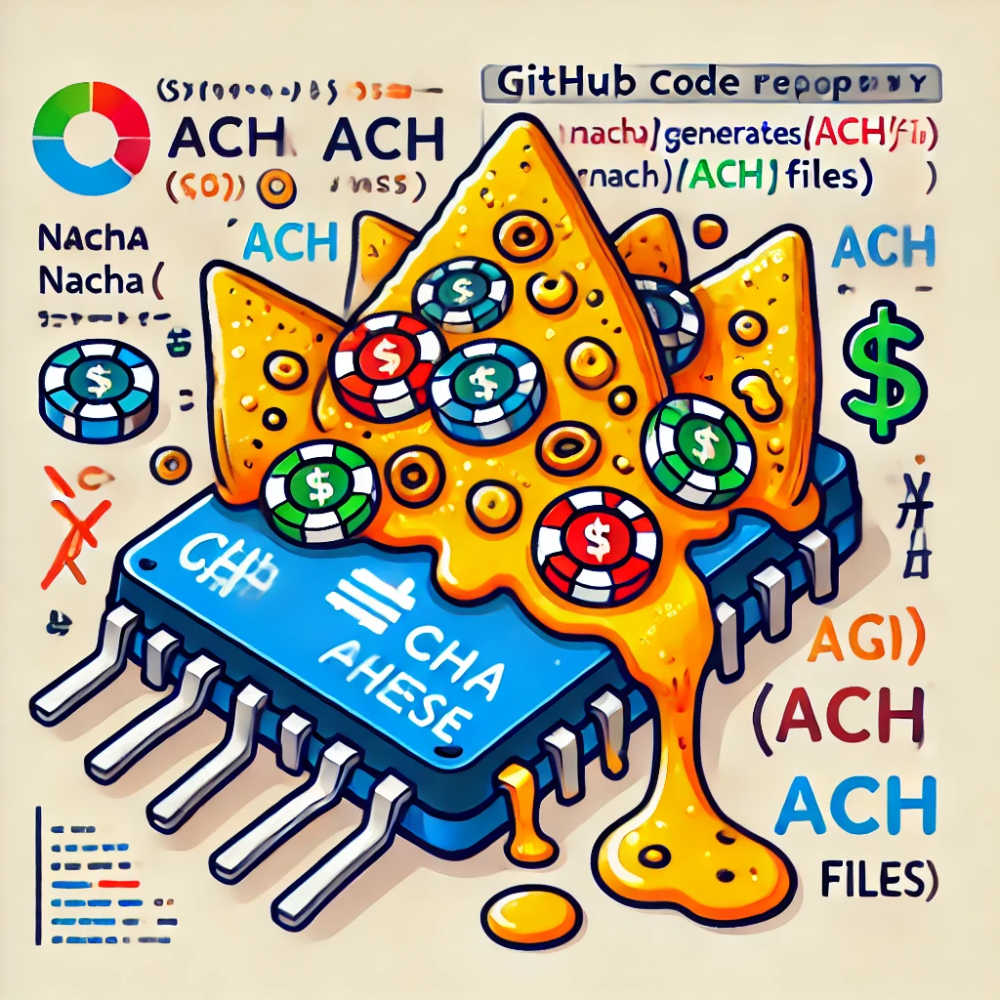

# Nacha Cheese

Nacha Cheese is a TypeScript library for generating NACHA (Automated Clearing House) files, which are used to initiate ACH transactions in the United States. The library provides a straightforward way to create, customize, and manage ACH files using an object-oriented approach.

## Features

-   Generate compliant NACHA (ACH) files
-   Support for both debit and credit transactions
-   Batch and entry-level customization
-   Support for addenda records
-   User-friendly API

## Installation

You can install Nacha Cheese using npm:

```bash
pnpm install nacha-cheese
```

```typescript
import {
    Nacha,
    Batch,
    Entry,
    ServiceClass,
    BatchCode,
    TransactionCode,
    EntryAddenda,
} from 'nacha-cheese';

// Create a new NACHA file
const nacha = new Nacha({
    originRoutingNumber: '011401533',
    originName: 'Some Bank',
    destinationRoutingNumber: '091000019',
    destinationName: 'Your Bank',
    fileCreationDate: new Date('2023-01-01T00:00:00.000Z'),
    fileIdModifier: 'A',
    referenceCode: '12',
});

// Create a batch for credit transactions (e.g., payroll)
const batchOne = new Batch({
    transactionTypes: ServiceClass.Credit,
    originCompanyName: 'Your Company Inc',
    originDiscretionaryData: 'A1',
    originIdentification: 'RAj2392',
    code: BatchCode.CCD,
    description: 'Payroll',
    descriptiveDate: new Date('2023-01-01T00:00:00.000Z'),
    effectiveEntryDate: new Date('2023-01-01T00:00:00.000Z'),
    originDfi: '01140153',
});

// Add a simple entry to the batch
batchOne.addEntry(
    new Entry({
        transactionCode: TransactionCode.CheckingCredit,
        destinationRoutingNumber: '091000019',
        destinationAccountNumber: '1234567897',
        amount: 3521, // Amount in cents ($35.21)
        transactionId: '000001309',
        destinationName: 'Leroy Jenkins',
    }),
);

// Add another entry with addenda
const entry = new Entry({
    transactionCode: TransactionCode.CheckingCredit,
    destinationRoutingNumber: '091000019',
    destinationAccountNumber: '1234567897',
    amount: 50.5, // Amount in cents ($0.505)
    transactionId: '000001313',
    destinationName: 'Leroy Jenkins',
});

// Add addenda information to the entry
entry.setAddenda(
    new EntryAddenda({
        info: 'Im a special boy',
    }),
);

// Add the entry with addenda to the batch
batchOne.addEntry(entry);

// Add the batch to the NACHA file
nacha.addBatch(batchOne);

// Create a second batch for debit transactions
const batchTwo = new Batch({
    transactionTypes: ServiceClass.Debit,
    originCompanyName: 'Your Company Inc',
    originDiscretionaryData: 'A1',
    originIdentification: 'Foobar',
    code: BatchCode.CCD,
    description: 'You Know',
    descriptiveDate: new Date('2024-04-01T00:00:00.000Z'),
    effectiveEntryDate: new Date('2024-04-01T00:00:00.000Z'),
    originDfi: '01140153',
});

// Add a debit entry to the second batch
batchTwo.addEntry(
    new Entry({
        transactionCode: TransactionCode.CheckingDebit,
        destinationRoutingNumber: '091000019',
        destinationAccountNumber: '1234567897',
        amount: 3.5, // Amount in cents ($0.035)
        transactionId: '5051309',
        destinationName: 'Richard Branson',
    }),
);

// Add the second batch to the NACHA file
nacha.addBatch(batchTwo);

// Generate the NACHA file output
const output = nacha.toOutput();

// Output the generated NACHA file
console.log(output);
```
